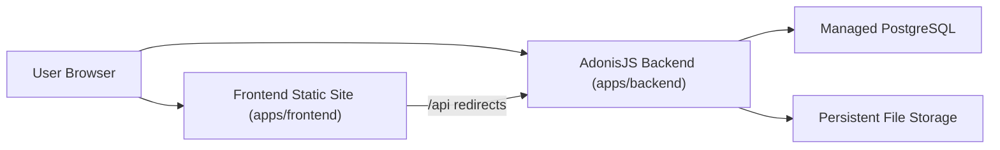

# Assignment B: Submission & Approval Workflow

This repository contains my submission for **Assignment B: Submission & Approval Workflow** from the Open Ownership Full-Stack Developer Technical Assessment.

The project is a two-sided web application where:

- an **Applicant** creates, edits, and submits an application
- a **Reviewer** picks up submitted applications, starts review, and then approves, rejects, or requests changes

The implementation is intentionally optimized around the assessment rubric: workflow correctness, server-side authorization, auditability, reproducible setup, and clear trade-off documentation.

## Assignment Scope

The core business record is an `Application`.

Implemented workflow states:

- `DRAFT`
- `SUBMITTED`
- `UNDER_REVIEW`
- `APPROVED`
- `REJECTED`
- `CHANGES_REQUESTED`

Core workflow rules:

- only the owner can edit and submit a `DRAFT`
- only a reviewer can move an application out of `SUBMITTED` or `UNDER_REVIEW`
- `UNDER_REVIEW` assigns the application to a specific reviewer
- `REJECTED` and `CHANGES_REQUESTED` require a reviewer comment
- `CHANGES_REQUESTED` returns to `DRAFT` through an explicit applicant action before editing resumes
- every status transition is written to an audit log in the same database transaction as the state change

## Live URL

- App URL: https://apptest.chandamulenga.com
- Backend API: https://api.apptest.chandamulenga.com (proxied through `/api` on the frontend)

### Test credentials

| Role | Email | Password |
|------|-------|----------|
| Applicant | `applicant@example.com` | `password1234` |
| Reviewer | `reviewer@example.com` | `password1234` |

The hosted app uses the architecture described below with seeded applicant and reviewer accounts for testing.

## Tech Stack

- **Monorepo**: `pnpm` + Turborepo
- **Backend**: AdonisJS 7, Lucid ORM, PostgreSQL, session auth, Bouncer, Drive, VineJS, Tuyau
- **Backend workflow support**: AdonisJS Plus Flow during development
- **Frontend**: React + Vite + TypeScript + shadcn/ui
- **Frontend data layer**: `@tuyau/react-query` with a base URL that defaults to `/api`
- **Cross-origin support**: backend CORS is enabled for the frontend origin in production
- **Database**: PostgreSQL
- **Local infrastructure**: Docker Compose for PostgreSQL and Mailpit
- **Hosting**: Sevalla (frontend at `apptest.chandamulenga.com`, backend at `api.apptest.chandamulenga.com`)

## Architecture



Deployment shape:

- frontend at `apptest.chandamulenga.com`
- backend at `api.apptest.chandamulenga.com`
- Sevalla redirects proxy `/api` requests from the frontend app to the backend service
- session auth uses cookie-based requests between the browser and backend

## Local Setup

### Prerequisites

- Node.js `24+`
- `pnpm` `11+`
- Docker and Docker Compose

### Install pnpm

If `pnpm` is not already installed:

```bash
corepack enable
corepack prepare pnpm@11.3.0 --activate
```

### Install dependencies

```bash
pnpm install
```

### Bootstrap backend environment

This copies `apps/backend/.env.example` to `apps/backend/.env` if needed and generates `APP_KEY` when missing.

The bootstrap command is Node-based, so it works in macOS, Linux, and native Windows shells without requiring Bash or WSL.

If `pnpm run setup` reports that the shell configuration already contains a pnpm section, rerun it with `--force` to replace the existing entry.

```bash
pnpm run setup
```

### Start local infrastructure

This starts PostgreSQL (development and test databases) and Mailpit using the backend compose file.

```bash
pnpm db:up
```

### Run migrations

```bash
pnpm db:migrate
```

### Seed the database

```bash
pnpm db:seed
```

### Start the app

Run the full monorepo in development from the repository root:

```bash
pnpm dev
```

This maps to `turbo dev` and is the canonical local development entry point.

### Helpful commands

```bash
pnpm db:status
pnpm db:logs
pnpm db:down
pnpm test
pnpm lint
pnpm typecheck
```

## Workspace Layout

- `apps/backend` - AdonisJS application
- `apps/frontend` - React/Vite application
- `docs/adr` - architectural decision records
- `CONTEXT.md` - shared domain glossary
- `AGENTS.md` - repo-specific engineering and submission rules

## Data Model

The current data model is intentionally simple and relational.

### Applications

An `Application` stores:

- applicant ownership
- title
- category
- description
- amount
- optional attachment metadata
- current status
- assigned reviewer when in review
- timestamps

### Audit log

An `Application` has a status-history relation that stores:

- actor
- previous status
- next status
- optional comment
- timestamp

The audit log records **status transitions only**, not generic draft edits.

### Options

Fixed lists such as categories are stored as backend-owned code-level option sets and exposed through an API endpoint. Database columns remain portable strings instead of database enums.

## API and Workflow Design

The API is designed around **explicit transition resources** instead of a generic status patch endpoint.

Implemented transition surfaces:

- create and edit applications as normal CRUD around `Application`
- submit a draft as a dedicated submission transition
- start review as a dedicated review-start transition
- approve, reject, and request changes as dedicated reviewer transitions
- move `CHANGES_REQUESTED` back to `DRAFT` as a dedicated applicant transition

This was chosen to make:

- authorization rules clearer
- workflow tests easier to write
- illegal transitions easier to reason about
- the audit trail more explicit

## Authorization Model

The app uses **session authentication** because the browser talks to the backend through cookie-based requests, with the frontend served on the main app domain and the backend served from the `api` subdomain.

Implemented authorization model:

- server-enforced role checks on every mutation
- explicit applicant ownership checks
- explicit reviewer assignment checks once an application is in `UNDER_REVIEW`
- seeded users for at least one Applicant and one Reviewer

Frontend route guards improve UX, but backend enforcement is the real security boundary.

## Error Handling

The backend uses **Problem Details** style error responses from the global exception handler in `apps/backend/app/exceptions/handler.ts`.

Current behavior:

- validation errors return structured field-aware responses
- authorization failures return clear forbidden responses
- not-found errors return structured not-found responses
- illegal workflow transitions return `409 Conflict`

Frontend requests use the browser session cookie, so the production backend must allow the frontend origin through CORS even though the frontend API client defaults to the proxied `/api` path in production.

## Testing Strategy

The test strategy is intentionally backend-heavy because that is where the assessment risk is concentrated.

Current baseline:

- 75 backend functional tests covering application lifecycle, workflow transitions, authorization, conflict handling, attachments, and session login
- frontend tests for routing, review workflow helpers, and component rendering

## Deployment

### Hosting shape

- **Backend**: containerized AdonisJS app on Sevalla at `api.apptest.chandamulenga.com` (`apps/backend/Dockerfile`, multi-stage Node.js build)
- **Frontend**: static site build on Sevalla at `apptest.chandamulenga.com` (Vite production output)
- **Routing**: Sevalla redirects proxy `/api` requests from the frontend app to the backend service
- **Database**: managed PostgreSQL

### Session auth and CORS

The browser talks to the backend through cookie-based session requests. In production:

- the frontend static site and the backend API are on different origins (main domain vs `api` subdomain)
- the Sevalla `/api` proxy makes the frontend's `/api` requests reach the backend transparently
- the backend CORS config (`apps/backend/config/cors.ts`) reads `CORS_ORIGIN` from the environment as a comma-separated allowlist and enables `credentials: true` so that session cookies travel cross-origin
- in development, CORS allows all origins; in production, only the configured frontend origin is allowed

### What the assessor can verify locally

The local setup mirrors the production shape: the backend runs with `SESSION_DRIVER=cookie`, the frontend Vite dev server proxies `/api` to the backend, and the seeded users let you sign in as either role without any additional configuration.

### AdonisJS Plus note

I used a paid personal AdonisJS Plus subscription and Flow during backend development to stay aligned with the standards and intended architecture of the AdonisJS ecosystem. That helped me keep the implementation focused on workflow behavior instead of manually composing and evaluating a larger mix of Node.js packages and conventions.

I verified the resulting architecture, APIs, workflow rules, and deployment implications directly in the repository.

## Architectural Decisions

Recorded ADRs:

- `docs/adr/0001-same-origin-session-auth-on-sevalla.md`
- `docs/adr/0002-explicit-transition-resources-for-application-workflow.md`

## Delivery Workflow

Development in this repo follows an issue -> PR -> review -> merge trail so the submission history stays legible instead of collapsing into one opaque implementation drop.

The delivery flow is:

1. capture the work as a GitHub issue
2. deliver the change in a reviewable PR with a Conventional Commit title (`<type>(<scope>): <short imperative summary>`)
3. use the PR template to describe the change, the related issue, and the verification that was performed
4. require human review before merge
5. merge only once the slice is correct, tested, and documented

This approach is deliberate for the assessment. It keeps scope under control, produces a readable delivery history, and makes workflow, authorization, and testing decisions easier to review incrementally.

Planning and delivery in this repo also use a small set of agent skills intentionally:

- `grill-with-docs` to reach a shared understanding of the workflow, architecture, and glossary before implementation
- `to-prd` to turn agreed design decisions into PRD issues
- `to-issues` to break PRDs into vertical-slice issues that can move through review cleanly

## Trade-offs

These are deliberate trade-offs for the exercise:

- **Explicit transition resources over generic status patching**: more routes, but much clearer workflow enforcement
- **Relational schema over JSON-heavy storage**: simpler querying, filtering, and tests for this fixed-form assessment
- **Backend-owned option sets over DB enums**: easier to evolve while keeping the backend as the source of truth
- **Single shared domain glossary**: the repo is a technical monorepo, but the business domain is one workflow
- **Attachment support kept minimal**: one current attachment only, no attachment version history
- **Audit log limited to status transitions**: enough to satisfy workflow traceability without overbuilding revision history

## What I Would Add Next

If I had more time after the core rubric is solid, I would prioritize:

- text search in reviewer queues
- richer queue tooling and saved filters
- notification delivery on status changes
- attachment version history across revision rounds
- stronger frontend test coverage
- more polished deployment automation for Sevalla

## AI Usage

| Tool | How it was used | What I verified manually |
| ---- | --------------- | ------------------------ |
| Codex / GPT-5 | Drafted and refined repository docs, stress-tested workflow decisions, and helped align the README with the implemented app surface | I reviewed the final README, ADRs, scripts, routes, and deployment notes against the repository state |
| AdonisJS Plus Flow | Used during backend development to keep the AdonisJS implementation aligned with framework-native patterns and standards | I reviewed the resulting architecture, APIs, workflow rules, and deployment implications directly in the repository |
| `grill-with-docs` | Used to sharpen the workflow, naming, deployment, and documentation decisions before implementation | I reviewed the resulting glossary terms, ADRs, and architectural constraints directly |
| `to-prd` | Used to convert the agreed design into PRD issues in GitHub | I reviewed the PRD structure, seams, and issue scope before publishing |
| `to-issues` | Used to break PRDs into vertical-slice implementation issues that can move through PR review cleanly | I reviewed the issue boundaries and confirmed each slice was coherent and testable |

The final submission was manually verified against the repository state after the AI-assisted drafting work.
