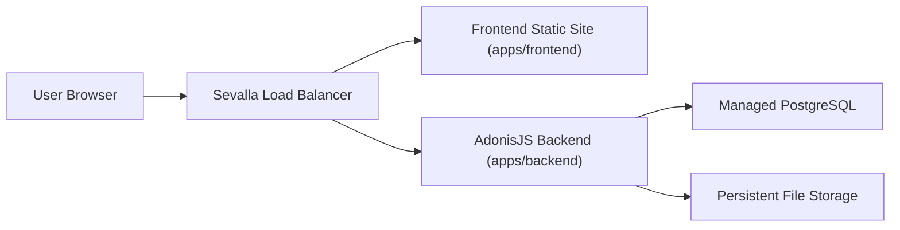

# Assignment B: Submission & Approval Workflow

This repository contains my submission for **Assignment B: Submission & Approval Workflow** from the Open Ownership Full-Stack Developer Technical Assessment.

The project is a two-sided web application where:

- an **Applicant** creates, edits, and submits an application
- a **Reviewer** picks up submitted applications, starts review, and then approves, rejects, or requests changes

The implementation is intentionally optimized around the assessment rubric: workflow correctness, server-side authorization, auditability, reproducible setup, and clear trade-off documentation.

## Assignment Scope

The core business record is an `Application`.

Planned workflow states:

- `DRAFT`
- `SUBMITTED`
- `UNDER_REVIEW`
- `APPROVED`
- `REJECTED`
- `CHANGES_REQUESTED`

Core workflow rules:

- only the owner can edit and submit a `DRAFT`
- only a reviewer can move an application out of `SUBMITTED` or `UNDER_REVIEW`
- `UNDER_REVIEW` assigns the application to a specific reviewer
- `REJECTED` and `CHANGES_REQUESTED` require a reviewer comment
- `CHANGES_REQUESTED` returns to `DRAFT` through an explicit applicant action before editing resumes
- every status transition is written to an audit log in the same database transaction as the state change

## Live URL

- App URL: `TBD`
- Test credentials: `TBD`

This section will be updated once the project is deployed on Sevalla.

## Tech Stack

- **Monorepo**: `pnpm` + Turborepo
- **Backend**: AdonisJS 7, Lucid ORM, PostgreSQL, session auth, Bouncer, Drive, VineJS, Tuyau
- **Frontend**: React + Vite + TypeScript + shadcn/ui
- **Frontend data layer**: `@tuyau/react-query`
- **Database**: PostgreSQL
- **Local infrastructure**: Docker Compose for PostgreSQL and Mailpit
- **Hosting target**: Sevalla

## Architecture



Deployment shape:

- one public app URL
- path-based routing
- `/` goes to the frontend
- `/api/*` goes to the backend
- session cookies are same-origin

## Local Setup

### Prerequisites

- Node.js `24+`
- `pnpm` `11+`
- Docker and Docker Compose

### Install pnpm

If `pnpm` is not already installed:

```bash
corepack enable
corepack prepare pnpm@11.3.0 --activate
```

### Install dependencies

```bash
pnpm install
```

### Bootstrap backend environment

This copies `apps/backend/.env.example` to `apps/backend/.env` if needed and generates `APP_KEY` when missing.

```bash
pnpm setup
```

### Start local infrastructure

This starts PostgreSQL and Mailpit using the backend compose file.

```bash
pnpm db:up
```

### Run migrations

```bash
pnpm db:migrate
```

### Seed the database

```bash
pnpm db:seed
```

### Start the app

Run the full monorepo in development from the repository root:

```bash
pnpm dev
```

This maps to `turbo dev` and is the canonical local development entry point.

### Helpful commands

```bash
pnpm db:status
pnpm db:logs
pnpm db:down
pnpm test
pnpm lint
pnpm typecheck
```

## Workspace Layout

- `apps/backend` - AdonisJS application
- `apps/frontend` - React/Vite application
- `docs/adr` - architectural decision records
- `CONTEXT.md` - shared domain glossary
- `AGENTS.md` - repo-specific engineering and submission rules

## Data Model

The current planned data model is intentionally simple and relational.

### Applications

An `Application` stores:

- applicant ownership
- title
- category
- description
- amount
- optional attachment metadata
- current status
- assigned reviewer when in review
- timestamps

### Audit log

An `Application` has a status-history relation that stores:

- actor
- previous status
- next status
- optional comment
- timestamp

The audit log records **status transitions only**, not generic draft edits.

### Options

Fixed lists such as categories are stored as backend-owned code-level option sets and exposed through an API endpoint. Database columns remain portable strings instead of database enums.

## API and Workflow Design

The API is designed around **explicit transition resources** instead of a generic status patch endpoint.

Examples of planned transition surfaces:

- create and edit applications as normal CRUD around `Application`
- submit a draft as a dedicated submission transition
- start review as a dedicated review-start transition
- approve, reject, and request changes as dedicated reviewer transitions
- move `CHANGES_REQUESTED` back to `DRAFT` as a dedicated applicant transition

This was chosen to make:

- authorization rules clearer
- workflow tests easier to write
- illegal transitions easier to reason about
- the audit trail more explicit

## Authorization Model

The app uses **session authentication** because frontend and backend share one public origin in production.

Current planned model:

- seeded users for at least one Applicant and one Reviewer
- server-enforced role checks on every mutation
- explicit applicant ownership checks
- explicit reviewer assignment checks once an application is in `UNDER_REVIEW`

Frontend route guards improve UX, but backend enforcement is the real security boundary.

## Error Handling

The backend is planned to use **Problem Details** style error responses from the global exception handler in `apps/backend/app/exceptions/handler.ts`.

Target behavior:

- validation errors return structured field-aware responses
- authorization failures return clear forbidden responses
- not-found errors return structured not-found responses
- illegal workflow transitions return `409 Conflict`

## Testing Strategy

The test strategy is intentionally backend-heavy because that is where the assessment risk is concentrated.

Planned baseline:

- unit tests for workflow transition rules
- unit tests for legal and illegal transitions
- unit tests for comment-required transitions
- API tests for authorization and forbidden actions
- API tests for illegal transitions returning `409`
- frontend tests only if they stay cheap and high-signal

## Deployment

Target deployment:

- **Backend**: containerized AdonisJS app on Sevalla
- **Frontend**: static site deployment on Sevalla
- **Routing**: one public origin behind a Sevalla load balancer
- **Database**: managed PostgreSQL

The backend Dockerfile lives at `apps/backend/Dockerfile`.

## Architectural Decisions

Recorded ADRs:

- `docs/adr/0001-same-origin-session-auth-on-sevalla.md`
- `docs/adr/0002-explicit-transition-resources-for-application-workflow.md`

## Delivery Workflow

Development in this repo follows a PRD-driven vertical-slice workflow so the project has a visible issue -> PR -> merge trail instead of one opaque implementation drop.

The intended flow is:

1. create a PRD issue for a major assessment concern
2. split that PRD into thin vertical-slice implementation issues
3. implement one slice per branch
4. open a PR for the slice
5. require human review before merge
6. merge only once the slice is correct, tested, and documented

This approach is deliberate for the assessment. It keeps scope under control, produces a readable delivery history, and makes workflow, authorization, and testing decisions easier to review incrementally.

## Trade-offs

These are deliberate trade-offs for the exercise:

- **Explicit transition resources over generic status patching**: more routes, but much clearer workflow enforcement
- **Relational schema over JSON-heavy storage**: simpler querying, filtering, and tests for this fixed-form assessment
- **Backend-owned option sets over DB enums**: easier to evolve while keeping the backend as the source of truth
- **Single shared domain glossary**: the repo is a technical monorepo, but the business domain is one workflow
- **Attachment support kept minimal**: one current attachment only, no attachment version history
- **Audit log limited to status transitions**: enough to satisfy workflow traceability without overbuilding revision history

## What I Would Add Next

If I had more time after the core rubric is solid, I would prioritize:

- text search in reviewer queues
- richer queue tooling and saved filters
- notification delivery on status changes
- attachment version history across revision rounds
- stronger frontend test coverage
- more polished deployment automation for Sevalla

## AI Usage

| Tool | How it was used | What I verified manually |
| ---- | --------------- | ------------------------ |
| Codex / GPT-5 | Planning the architecture, stress-testing workflow decisions, drafting repo guidance, and generating setup/documentation scaffolding | I reviewed the resulting repo rules, setup commands, ADRs, and documentation choices directly |
| AI-assisted development workflow | Used for design iteration, implementation planning, and documentation shaping | I am responsible for validating every code path, workflow rule, and setup instruction before submission |

This section will be expanded with implementation-specific entries as development continues.
